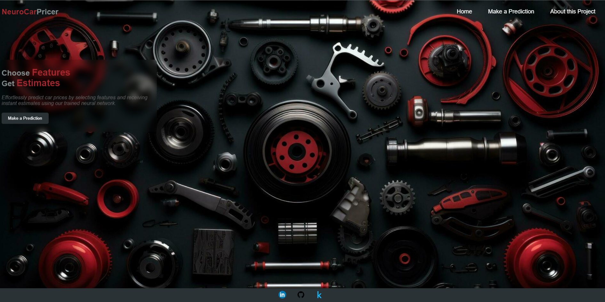
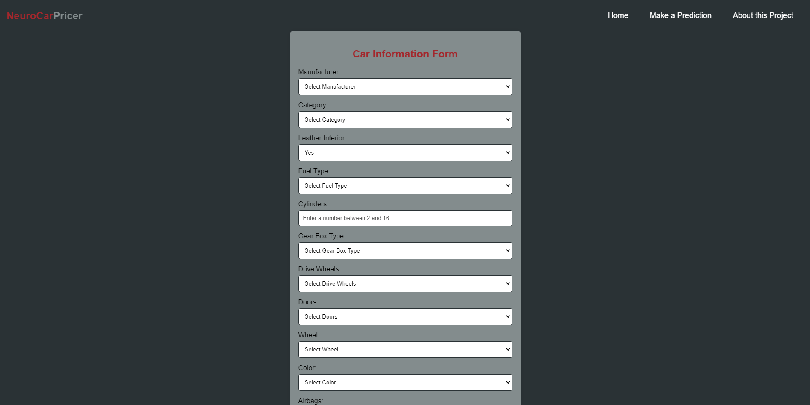
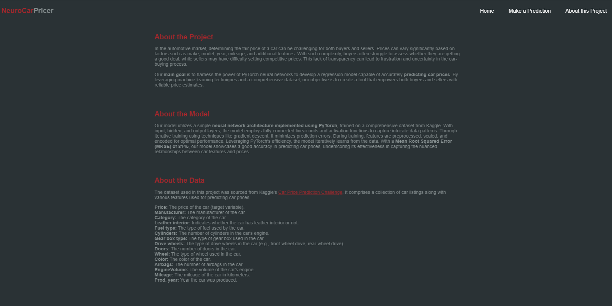

# Car Price Prediction

An end-to-end project with pytorch, DVC and AWS Deployment.

---
## Project Overview

This project aims to predict the price of a car based on its features using a neural network model. The workflow involves the following steps:

1. **Data Collection**: Data is obtained from Kaggle using the Kaggle API. This data contains various features of cars, such as mileage, engine size, and year of manufacture.

2. **Data Preprocessing**: The collected data undergoes preprocessing to clean, transform, and prepare it for model training.

3. **Model Training**: A neural network model is trained using the preprocessed data. The model learns to predict the price of a car based on its features.

4. **Web Application**: A user-friendly web application is developed to enable users to input car features and receive price predictions in real-time.

By combining data collection, preprocessing, model training, and web development techniques, this project offers a comprehensive solution for car price prediction that can be easily accessed and utilized by users.

---
## Web Application

The web application comprises three main pages:

#### Home Page

The home page serves as the primary interface for users and provides an overview of the application's functionality along with navigation options to access other pages.


*Figure 1: Home Page*

#### Form Page

The form page enables users to input various car features. Upon submission, the form triggers a POST request to the server to generate price predictions based on the provided features.


*Figure 2: Form Page*

#### About Page

The about page offers detailed information about the project, including its purpose, the underlying neural network model used for prediction, and a description of the dataset utilized for training the model.


*Figure 3: About Page*

These pages collectively provide users with an intuitive and interactive experience, facilitating easy exploration of the application's capabilities and insights into car price predictions.


---
## Deploy and Run the Application with Docker

1. **Download the Docker Image**:

Pull the Docker image from Docker Hub with the following command:
``` bash
docker pull username/repository:tag
```

2. **Run a docker container**:

Launch a Docker container based on the downloaded image, specifying port mappings to expose port 8080:

```bash
docker run -p 8000:8000 -e PORT=8080 your_username/your_image_name:tag
```

Ensure the container is running by opening your browser and navigating to localhost:8080. You can now use the application to make predictions!

---
## Get the Code and Set Up Locally

### Cloning the Repository and Setting Up Environment

To run the application on your local machine, follow these steps:

1. **Clone the Repository**:

Start by cloning the project repository from GitHub. Open your terminal and run the following command:

```bash
git clone https://github.com/idalz/car-price-prediction.git
```

2. **Create a Conda Environment**

Set up a Conda environment to isolate the project dependencies. Run the following commands in your terminal:

```bash
conda create -n venv python=3.8 -y
```

```bash 
conda activate venv 
```

3. **Install Requirements**

Install the project dependencies by executing the following command:

```bash
pip install -r requirements.txt
```

### Executing the Training Pipeline

To prepare the application for use, you'll need to execute the training pipeline. You can accomplish this by running the `main.py` or using DVC (Data Version Control).

- **Using  `main.py` script** 

Using main.py directly executes the training pipeline in a sequential manner, performing data ingestion, preprocessing, and model training all within the same script.

```bash
python main.py
```

- **Using Data Version Control**

Using DVC not only executes the training pipeline like main.py but also systematically documents each step of the process.

Initialize DVC in your project directory by running:

```bash
dvc init
```

Reproduce the training pipeline with the following command:

```bash
dvc repro
```

 You can visualize the dependency graph to understand the pipeline's structure:

```bash
dvc dag
```

By following these steps, you'll prepare the application for use and ensure that the model is trained and ready for predictions.

### Running the Application

There are two options to run the application:

- **Using Python**

You can run the app using Python with the following command:
   
```bash
python app.py
```

- **Using Gunicorn (WSGI)**

Alternatively, you can run the app using Gunicorn with the following command:

```bash
gunicorn -w 4 -b 0.0.0.0:8080 app:app
```

Once the application is running, you can open your web browser and navigate to localhost:8080 to access the application and try some predictions!

---
## Project Workflow

1. Update config.yaml
2. Update secrets.yaml [Optional]
3. Update params.yaml
4. Update entity
5. Update the configuration manager in src config
6. Update the components
7. Update the pipeline
8. Update main\.py
9. Update the dvc.yaml

---
## AWS CICD Deployment with Github Actions

TODO

---
## Core Technologies

- numpy
- pandas
- matplotlib
- seaborn
- scikit-learn
- torch
- Flask
- Flask-Cors
- gunicorn
- dvc

---
## License

This project is licensed under the [MIT License](LICENSE).
